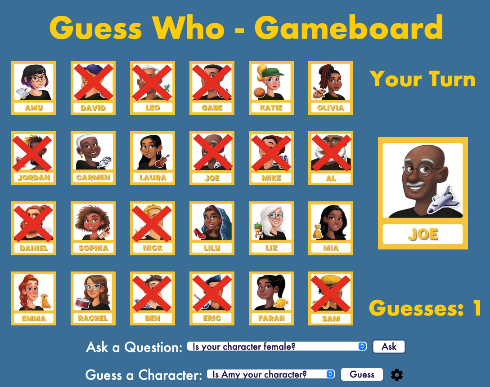

# GUESS WHO 

## Overview

The Guess Who ISP is a fun and interactive Java game based on the classic “Guess Who?” board game. Players take turns asking yes/no questions to figure out their opponent’s character. The game features an AI opponent, a dynamic leaderboard, customizable themes, and background music for an engaging experience.

## Features

- User-Friendly Interface: Easy-to-use buttons, dropdowns, and visuals for smooth gameplay.
- AI Opponent: Challenges players with logical guesses and elimination.
- Persistent Leaderboard: Tracks high scores across sessions.
- Customizable Themes: Switch between light and dark modes.
- Background Music: Toggle music and sound effects for a fun atmosphere.
- Dynamic Gameplay: The board updates automatically as characters and questions are eliminated.

## How to Play

1. Start the program in any Java-compatible software such as VS code, Eclipse, etc.
2. On the welcome screen:
    - Click “Start” to play.
	- View “Rules / How to Play” for instructions.
	- Check “Leaderboard” to see top scores.
3. In the gameboard:
	- Choose your character.
	- Use the dropdown to ask questions or guess the AI’s character.
	- Win by guessing correctly before the AI!

## Project Breakdown

- Gameboard: Manages turns, win conditions, and game logic
- GUI: Handles the visuals and player interactions
- AI: Selects characters and narrows down guesses logically
- Music: Plays background music and sound effects
- Leaderboard: Saves and shows player scores
- Character/Question/PlayerGuesses: Stores game data for characters, questions, and guesses
